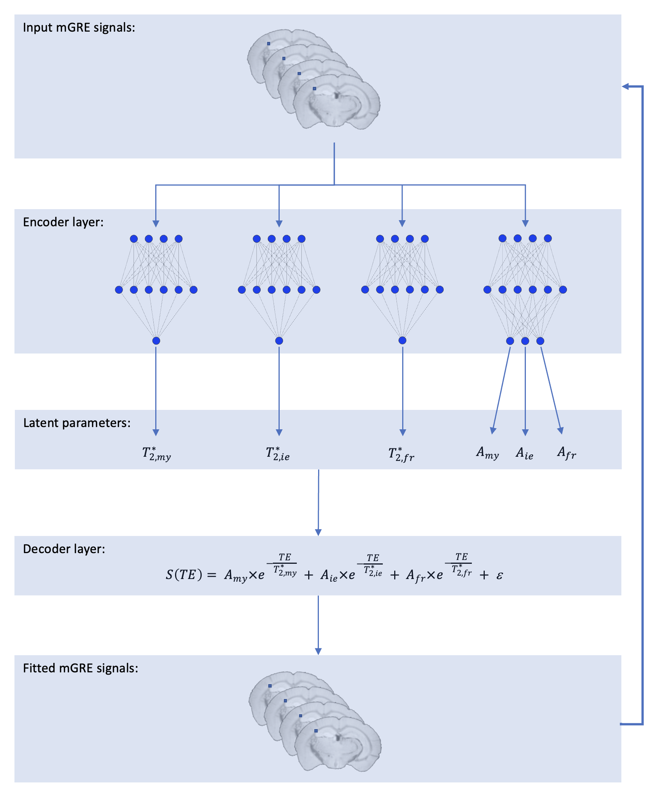

# SLED
[Self-Labelled Encoder-Decoder (SLED)](https://doi.org/10.1016/j.neuroimage.2022.119717) for myelin water imaging data analysis

## How SLED works:
- Data: multi-echo myelin water imaging (MWI) data
- Encoder: a series of neural networks to estimate latent parameters such as T<sub>2</sub> or T<sub>2</sub><sup>*</sup> times and amplitudes
- Decoder: a typical 3-pool model (myelin, axonal, and free water pools)
- Training: exclusively trained for each dataset which is self-labelled



## File structure in this repo
- *configs*: configuration files for all the fitting initialization parameters
- *data*: data to be fitted are stored here by default (change the path in config file if the data are located elsewhere)
- *models*: trained model (the best epoch) is saved here by default
- *results*: parameter maps are saved here by default
- *src*: source code is placed here
    - *models*: building blocks for the SLED model and the code for model training
    - *utility*: utility functions for image processing and customized tensorflow losses
    - *main.py*: entry point to the SLED fitting

## Run SLED fitting
- Clone this repo to your local computer
    ```
    git clone git@github.com:hanwencat/SLED.git
    ```
- Nevigate to the root of this repo (should be on the `exp_3pool` branch by default, not the `master` branch)
- Use conda to create a virtual environment for the SLED fitting
    ```
    conda env create -n sled -f environment.yml
    conda activate sled
    ```
- Modify the config file as needed (e.g. the data_path in the *configs/defaults.yml*)
- Run the *src/main.py* to fit
    ```
    python src/main.py
    ```
- The model training process is logged in *logs/training.log*
- Fitted maps are saved in the *result/* folder 
    - *mwf.nii.gz*: the fitted MWF map
    - *t2s.nii.gz*: the fitted t2 times for the 3 pools (4D data)
    - *amps.nii.gz*: the fitted amplitudes for the 3 pools (4D data)
- The fitting configuration (everyting in the config file) are stored as nifty header extension (NIFTI_ECODE_COMMENT) for all fitted maps (https://nipy.org/nibabel/devel/biaps/biap_0003.html)

## Reference
Please cite this paper https://doi.org/10.1016/j.neuroimage.2022.119717